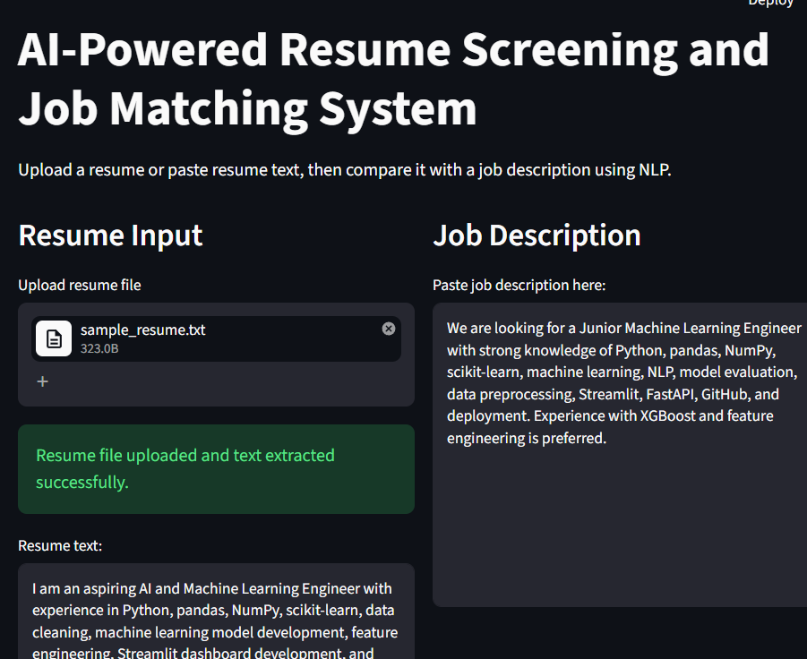

# AI-Powered Resume Screening and Job Matching System

## Live Demo

Try the deployed application here:

[AI Resume Job Matcher App](https://ai-resume-job-matcher-nafiz1.streamlit.app/)

## Application Screenshot

# AI-Powered Resume Screening and Job Matching System

This project is an NLP-based resume screening system that compares a candidate's resume with a job description and generates a resume-job match score. It also identifies matched technical skills, missing skills, and provides improvement suggestions.

The goal of this project is to demonstrate practical Natural Language Processing, similarity matching, text extraction, and deployment-ready Streamlit application development.

## Project Overview

Recruiters often need to screen many resumes against a specific job description. This system helps automate the first-level screening process by analyzing how closely a resume matches the technical requirements of a job description.

Users can upload a resume file or paste resume text, provide a job description, and receive an instant analysis report.

## Features

* Upload resume files in TXT, PDF, or DOCX format
* Extract text automatically from uploaded resumes
* Compare resume text with job description
* Calculate resume-job match score using TF-IDF and Cosine Similarity
* Detect matched technical skills
* Detect missing technical skills
* Generate resume improvement suggestions
* Download a resume screening analysis report
* Interactive Streamlit web application

## Technologies Used

* Python
* Streamlit
* scikit-learn
* TF-IDF Vectorization
* Cosine Similarity
* pypdf
* python-docx
* Regular Expressions

## Project Structure

resume-screening-system/

├── app.py
├── resume_matcher.py
├── utils.py
├── requirements.txt
├── README.md
├── .gitignore
├── data/
│   ├── sample_resume.txt
│   └── sample_job_description.txt
├── notebooks/
└── venv/

## How the System Works

1. The user uploads a resume or pastes resume text.
2. The user provides a job description.
3. The system extracts text from the resume file if uploaded.
4. TF-IDF Vectorization converts the resume and job description into numerical vectors.
5. Cosine Similarity calculates how similar the resume is to the job description.
6. A skill extraction module identifies matched and missing technical skills.
7. The system displays match score, skill insights, and improvement suggestions.
8. The user can download the analysis report.

## Methodology

### Text Extraction

The system supports text extraction from:

* TXT files
* PDF files
* DOCX files

### Similarity Matching

The resume and job description are converted into TF-IDF vectors. Cosine Similarity is then used to calculate the similarity score between the two documents.

### Skill Extraction

A curated technical skill dictionary with regex-based pattern matching is used to detect relevant skills from both the resume and job description.

## Current Output

The application provides:

* Resume Match Score
* Matched Skills
* Missing Skills
* Resume Improvement Suggestions
* Downloadable Analysis Report

## How to Run Locally

Clone the repository and navigate to the project folder.

Create a virtual environment:

python -m venv venv

Activate the virtual environment:

venv\Scripts\activate

Install dependencies:

pip install -r requirements.txt

Run the Streamlit app:

python -m streamlit run app.py

## Future Improvements

* Add Sentence-BERT based semantic similarity
* Add FastAPI backend
* Add resume ranking for multiple candidates
* Add job role recommendation
* Add advanced skill gap analysis
* Add PDF report generation
* Deploy the application online

## Portfolio Value

This project demonstrates practical skills in:

* Natural Language Processing
* Resume parsing
* Similarity matching
* Text preprocessing
* Skill extraction
* Streamlit application development
* End-to-end ML project structuring

## Author

Developed as part of an AI/ML portfolio-building roadmap focused on applied machine learning, NLP, deployment, and research-oriented project presentation.
